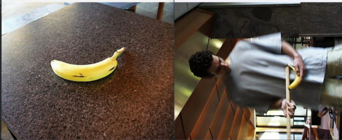

# Imfind: Content-Based Image Retrieval

This project is a C++ application for content-based image retrieval (CBIR), allowing you to find images in a database that are visually similar to a target image. It explores and implements a variety of techniques for extracting image features and measuring similarity.



## 📖 Project Description

This application provides a flexible pipeline for experimenting with different image retrieval techniques. You can extract a variety of features from a database of images, save these features for quick access, and then use different distance metrics to find the best matches for a given image. The system is designed to be efficient, with the ability to pre-process and store image features to accelerate the matching process on subsequent runs.

## ✨ Features

This project implements several different methods for image matching, from simple pixel comparisons to more advanced deep learning and custom feature-based approaches.

  * **Baseline Matching:** A simple and fast approach that compares a 7x7 central region of interest in images using the Sum of Squared Differences (SSD) on raw pixel values.
  * **Histogram Matching:**
      * **RG Histogram:** Uses a 2D histogram of the red and green color channels to find images with similar color compositions, compared using histogram intersection.
      * **Multi-Histogram:** Divides the image into two halves and compares the RGB histograms of each half separately to account for spatial color distribution.
  * **Texture and Color:** A combined approach that uses a Sobel magnitude histogram to capture texture and edge information, along with an RGB histogram for color. The similarity is measured using the Bhattacharyya distance.
  * **Deep Network Embeddings:** Leverages the power of deep learning by using feature vectors extracted from the final average pooling layer of a ResNet18 network pre-trained on ImageNet. The cosine distance is used to compare these feature vectors, which is effective at capturing object-level similarities.
  * **Custom Feature Matching:** A sophisticated, custom-designed feature set that combines:
      * **HSV histograms** for robust color analysis.
      * **Gabor filter responses** for detailed texture information.
      * **Fourier transforms** to analyze frequency content.
        The similarity is calculated as a weighted sum of the Chi-squared distance (for histograms) and cosine distance (for Gabor and Fourier features), providing a nuanced and powerful matching capability.

## 🚀 Getting Started

To get a local copy up and running, follow these simple steps.

### Prerequisites

  * A C++ compiler
  * OpenCV
  * CMake

### Installation

1.  Clone the repository:
    ```sh
    git clone https://github.com/adnanamir010/imfind.git
    ```
2.  Build the project using CMake.

## 💻 Usage

After building the project, you can run the executable to start performing image matching. You will need a database of images and a target image to begin. The program will then extract features from the images in the database, compare them to the target image's features, and display the most similar results. You can configure the program to use any of the feature extraction and matching methods described above.